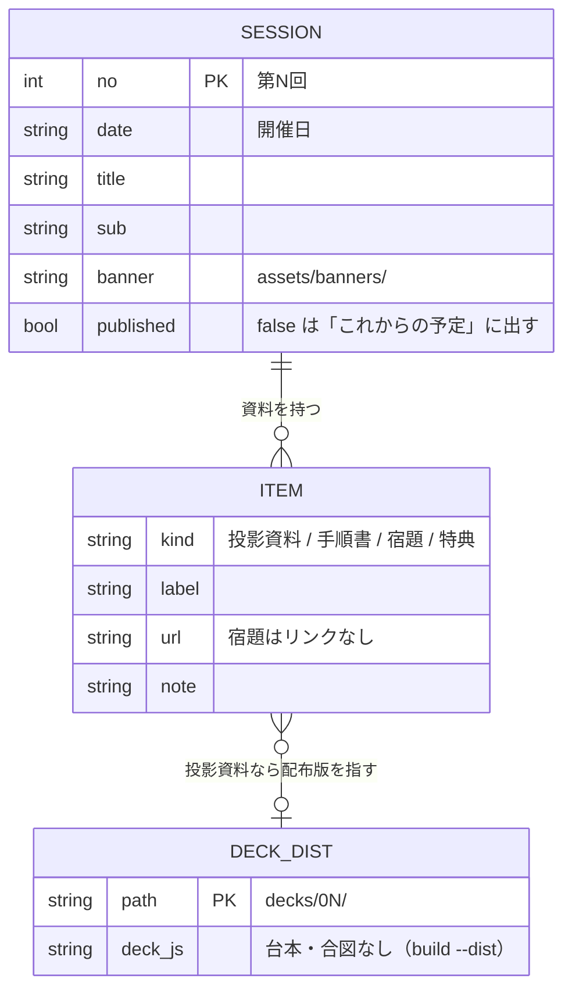

# データ構造

```mermaid
erDiagram
    SESSION ||--o{ ITEM : "資料を持つ"
    ITEM }o--o| DECK_DIST : "投影資料なら配布版を指す"
    SESSION {
        int no PK "第N回"
        string date "開催日"
        string title
        string sub
        string banner "assets/banners/"
        bool published "false は「これからの予定」に出す"
    }
    ITEM {
        string kind "投影資料 / 手順書 / 宿題 / 特典"
        string label
        string url "宿題はリンクなし"
        string note
    }
    DECK_DIST {
        string path PK "decks/0N/"
        string deck_js "台本・合図なし（build --dist）"
    }
```

- SESSION と ITEM は `sessions.js` に入れ子で持つ（DBは使わない）
- 投影版のデッキ（台本・Notion埋め込みあり）は公開リポジトリに置かない
